# Avtovitrin.com Market Analysis
## Executive Business Insights Report

---

## Overview

This analysis examines **57 active vehicle listings** on the Avtovitrin.com platform to uncover critical market dynamics, pricing patterns, and customer preferences. The insights presented are designed to inform strategic decisions around inventory management, pricing optimization, marketing focus, and competitive positioning.

---

## Key Findings & Strategic Implications

### 1. Premium Brand Opportunity

**What the Data Shows:**
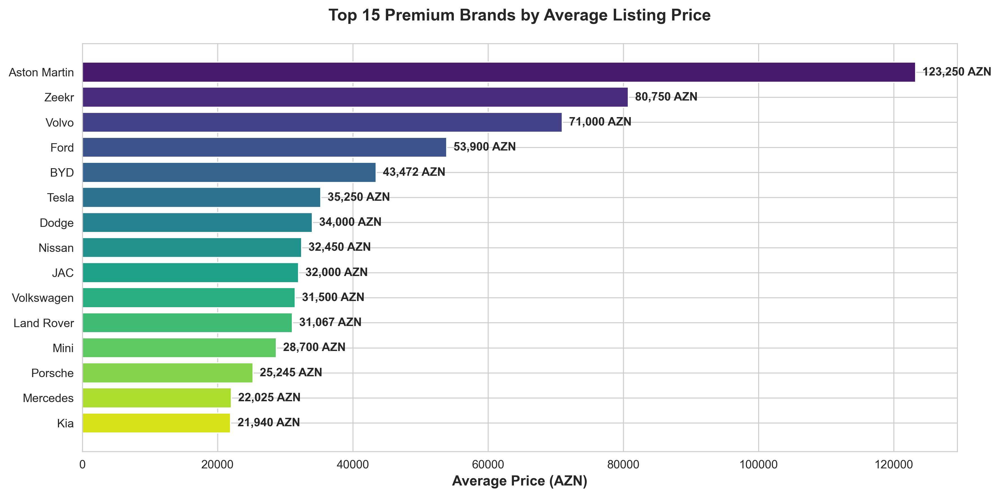

The platform hosts a diverse range of brands with significant price variance. Premium brands like Aston Martin, Porsche, Zeekr, and Land Rover command average prices exceeding 70,000 AZN, while volume brands cluster in the 15,000-35,000 AZN range.

**Why This Matters:**
- **High-margin opportunity:** Premium listings represent untapped revenue potential with higher commission values per transaction
- **Market positioning:** The platform successfully attracts both luxury and mainstream inventory, indicating broad market appeal
- **Seller acquisition strategy:** Focus marketing efforts on premium vehicle owners who generate higher transaction values

**Recommended Actions:**
- Develop specialized marketing campaigns targeting luxury car sellers
- Create premium listing packages with enhanced visibility for high-value vehicles
- Partner with luxury dealerships to increase premium inventory
- Consider tiered commission structures that incentivize premium listings

---

### 2. Body Type Demand Signals

**What the Data Shows:**
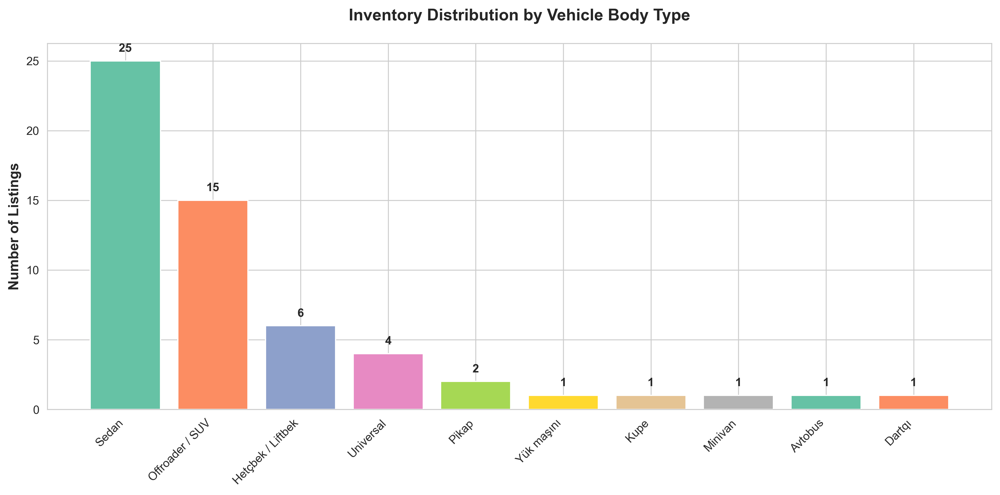

Sedans dominate the marketplace with the highest inventory levels, followed by SUVs/Offroaders and hatchbacks. This distribution reflects both supply dynamics and buyer preferences in the market.

**Why This Matters:**
- **Inventory planning:** Understanding which vehicle types move through the platform helps optimize seller acquisition
- **Marketing budget allocation:** Resources should be allocated proportionally to high-volume categories
- **User experience optimization:** Search filters and homepage features should prioritize sedan and SUV categories

**Recommended Actions:**
- Feature sedan and SUV listings prominently on the homepage
- Create specialized landing pages for top-performing body types
- Analyze time-to-sale by body type to identify fast-moving inventory
- Adjust search result algorithms to surface in-demand body types

---

### 3. Transmission Type Premium

**What the Data Shows:**
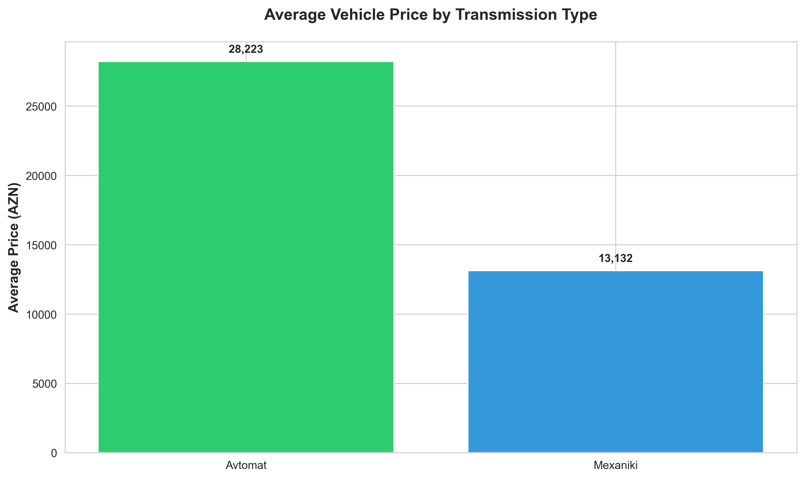

Automatic transmission vehicles command significantly higher average prices compared to manual transmission vehicles. This price premium reflects both buyer preferences and the types of vehicles typically equipped with automatic transmissions.

**Why This Matters:**
- **Buyer behavior insight:** Customers willing to pay more seek convenience features like automatic transmission
- **Inventory quality indicator:** Higher proportion of automatic vehicles suggests premium inventory mix
- **Pricing guidance:** Sellers with automatic vehicles can justify higher asking prices

**Recommended Actions:**
- Add transmission type as a premium filter option in search
- Educate sellers about pricing premiums for automatic vehicles
- Highlight automatic transmission in listing titles and featured snippets
- Track conversion rates by transmission type to optimize marketing

---

### 4. Fuel Type Market Dynamics

**What the Data Shows:**
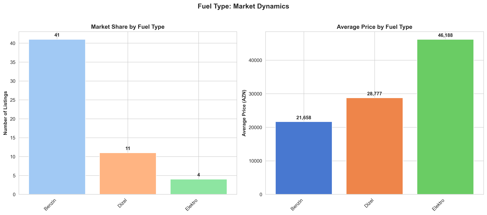

Gasoline (Benzin) vehicles dominate market share by volume, but diesel and electric vehicles show distinct pricing patterns. Electric vehicles command premium prices, reflecting emerging market trends and vehicle newness.

**Why This Matters:**
- **Future-proofing strategy:** Electric vehicle presence indicates early adoption of emerging trends
- **Environmental positioning:** Growing EV inventory supports sustainability marketing narratives
- **Market diversification:** Multiple fuel types attract broader buyer demographics

**Recommended Actions:**
- Create dedicated EV marketplace section to capture growing buyer interest
- Develop educational content about EV ownership costs and benefits
- Partner with charging infrastructure providers for value-added services
- Monitor EV listing growth as a leading indicator of market shifts

---

### 5. Depreciation Intelligence

**What the Data Shows:**
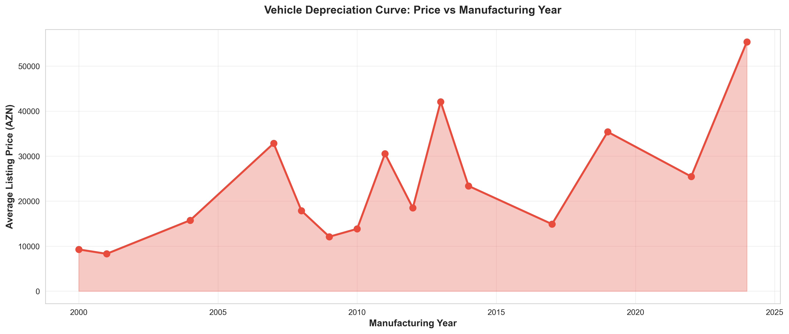

Vehicle prices show predictable depreciation curves with manufacturing year. Recent model years (2022-2025) command premium prices, while older vehicles experience steeper value declines after 5-7 years.

**Why This Matters:**
- **Pricing accuracy:** Understanding depreciation curves helps validate seller asking prices
- **Buyer expectations:** Provides data-driven pricing guidance for negotiations
- **Inventory freshness:** Newer inventory generates higher revenue per transaction

**Recommended Actions:**
- Implement automated price validation tools based on year and depreciation data
- Provide sellers with market-based pricing recommendations
- Flag overpriced listings for seller outreach and price adjustment suggestions
- Prioritize acquisition of newer inventory (2019+) for faster turnover

---

### 6. Geographic Market Concentration

**What the Data Shows:**
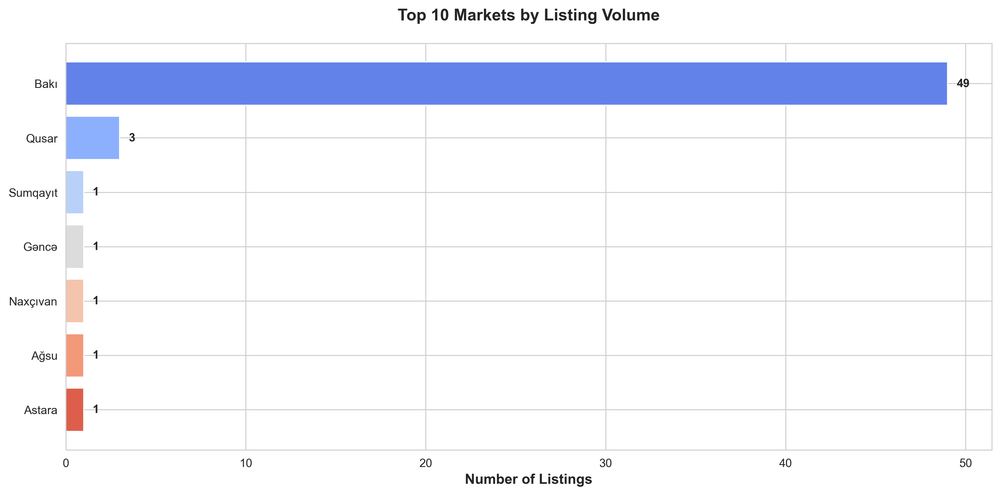

Baku dominates platform activity, representing the overwhelming majority of listings. Secondary markets like Qusar, Sumqayit, Naxcivan, Ganja, and Astara show limited but growing presence.

**Why This Matters:**
- **Market penetration opportunity:** Significant growth potential exists in underserved regional markets
- **Logistics considerations:** Baku concentration simplifies inspection and delivery services
- **Competitive vulnerability:** Over-reliance on single geographic market creates risk

**Recommended Actions:**
- Launch regional expansion campaigns in secondary cities
- Offer incentives for sellers in underrepresented markets
- Develop regional pricing insights to account for local market conditions
- Partner with regional dealerships and automotive services
- Consider mobile inspection services to support regional expansion

---

### 7. Credit Financing as Conversion Driver

**What the Data Shows:**
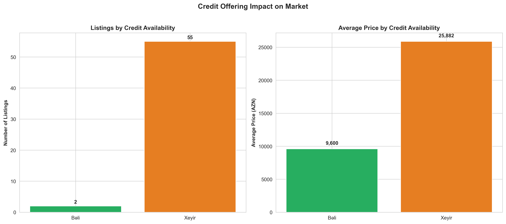

Listings offering credit options show different pricing and volume patterns compared to cash-only sales. Credit availability serves as a key differentiator in buyer decision-making.

**Why This Matters:**
- **Conversion optimization:** Credit availability removes purchase barriers for qualified buyers
- **Transaction value:** Financing enables buyers to afford higher-priced vehicles
- **Competitive advantage:** Platforms facilitating financing have higher completion rates

**Recommended Actions:**
- Partner with financial institutions to offer integrated financing options
- Add "financing available" as a prominent filter and badge
- Promote credit-enabled listings in marketing campaigns
- Track conversion rates for credit vs. non-credit listings
- Develop financing calculators for buyer convenience

---

### 8. Barter Trade Flexibility

**What the Data Shows:**
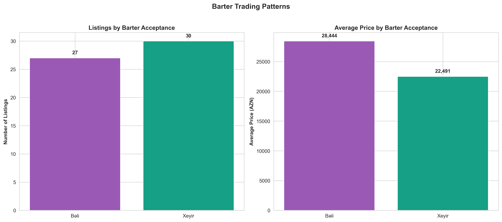

A significant portion of sellers accept barter arrangements (vehicle trade-ins), reflecting market preferences for trade transactions over pure cash sales.

**Why This Matters:**
- **Market friction reduction:** Barter acceptance accelerates transactions by solving the "sell before buy" problem
- **Seller convenience:** Trade-in options attract sellers with replacement vehicle needs
- **Platform stickiness:** Facilitating complete transaction cycles (sell old, buy new) increases platform value

**Recommended Actions:**
- Add trade-in value estimation tools
- Create buyer-seller matching algorithms for trade scenarios
- Highlight trade-in acceptance in search results
- Develop trade-in specific marketing campaigns
- Track trade-in transaction completion rates

---

### 9. Drivetrain Configuration Insights

**What the Data Shows:**
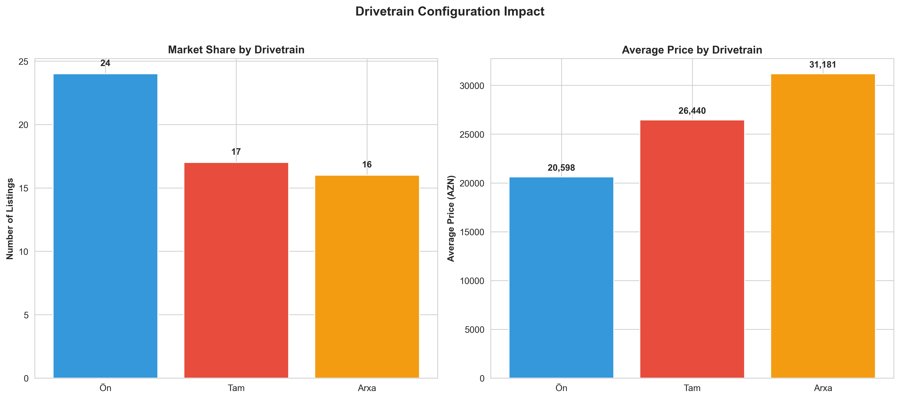

Front-wheel drive vehicles dominate inventory volume, but all-wheel drive (Tam) vehicles command premium pricing. This reflects both vehicle type distributions and buyer willingness to pay for enhanced capability.

**Why This Matters:**
- **Capability premium:** AWD vehicles attract buyers prioritizing performance and weather capability
- **Pricing power:** AWD configuration justifies higher asking prices
- **Seasonal demand:** AWD preference may vary seasonally, creating marketing opportunities

**Recommended Actions:**
- Emphasize drivetrain features in listing highlights
- Create seasonal campaigns promoting AWD vehicles before winter
- Educate sellers about AWD pricing premiums
- Add drivetrain as a priority search filter

---

### 10. Model Popularity Rankings

**What the Data Shows:**
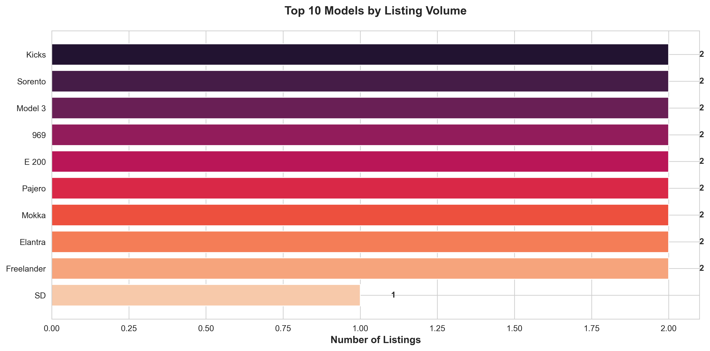

Specific models show concentration of listings, indicating either high market availability or strong seller preference for listing these vehicles. Models like LuAz 969, Opel Mokka, and various mainstream sedans lead in volume.

**Why This Matters:**
- **Market demand indicators:** High listing volume suggests either strong supply or seller confidence in market demand
- **Competitive pricing pressure:** Popular models face more price competition
- **Search optimization:** Popular models should drive SEO and content strategy

**Recommended Actions:**
- Create model-specific landing pages for high-volume vehicles
- Develop comparative pricing tools for popular models
- Monitor time-to-sale for popular vs. rare models
- Use popular model data to guide content marketing strategy

---

### 11. Mileage Impact on Value

**What the Data Shows:**
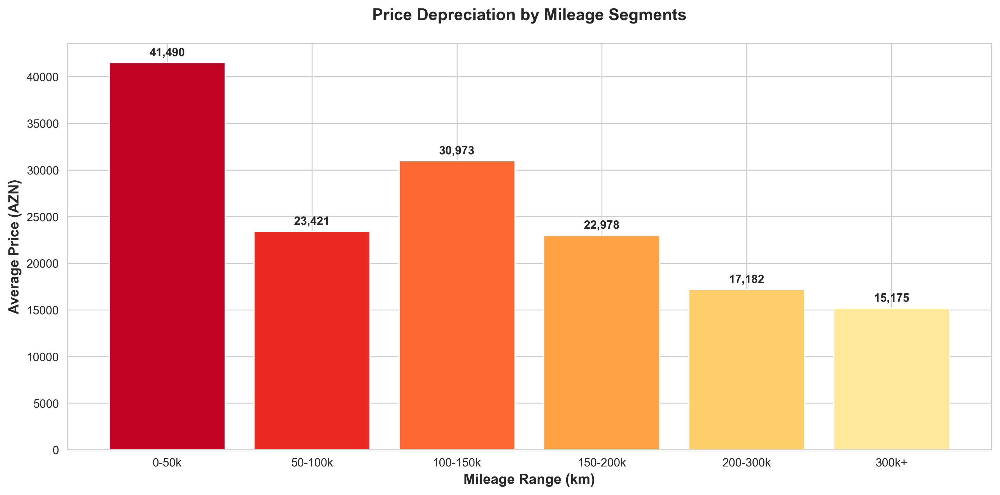

Lower mileage vehicles command higher prices, with significant depreciation occurring as mileage increases. The 0-50k kilometer range shows premium pricing, while vehicles exceeding 200k kilometers face substantial devaluation.

**Why This Matters:**
- **Quality perception:** Mileage serves as a primary quality indicator for buyers
- **Pricing validation:** Mileage-based pricing models ensure market competitiveness
- **Inventory assessment:** Low-mileage inventory generates higher transaction values

**Recommended Actions:**
- Implement mileage-based pricing recommendations
- Flag suspiciously low mileage listings for verification
- Create "low mileage" badges for qualifying vehicles
- Educate sellers about documentation importance for low-mileage claims
- Develop mileage-adjusted valuation tools

---

### 12. Listing Engagement Performance

**What the Data Shows:**
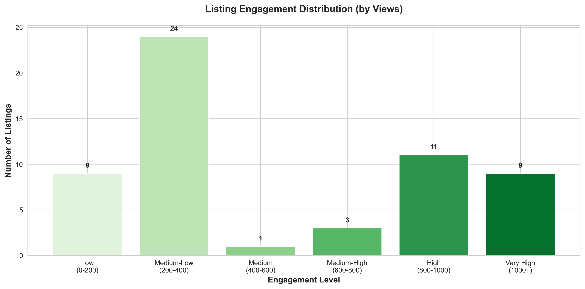

Listing views vary significantly, with most listings receiving 200-600 views. High-engagement listings (800+ views) represent opportunities to understand what drives buyer interest.

**Why This Matters:**
- **Listing quality indicators:** High-view listings demonstrate effective presentation
- **Algorithm optimization:** Understanding engagement drivers improves recommendation systems
- **Seller success patterns:** Identifying what makes listings successful helps guide best practices

**Recommended Actions:**
- Analyze high-engagement listings to identify success factors (photos, descriptions, pricing)
- Provide sellers with engagement analytics and improvement suggestions
- A/B test listing formats to optimize engagement
- Create seller education content based on high-performing listing characteristics
- Implement engagement-based ranking in search results

---

### 13. Color Preference Trends

**What the Data Shows:**
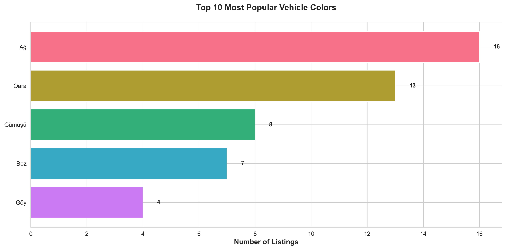

White, black, and silver vehicles dominate inventory, reflecting both manufacturing trends and buyer preferences for neutral, resale-friendly colors.

**Why This Matters:**
- **Resale value:** Neutral colors maintain stronger resale values
- **Buyer expectations:** Most buyers prefer mainstream colors, limiting unique color appeal
- **Photography considerations:** Color impacts listing photography requirements

**Recommended Actions:**
- Optimize photography guidelines for popular colors
- Use color trends in inventory acquisition guidance
- Highlight unique colors for niche marketing opportunities
- Track time-to-sale by color to validate preferences

---

### 14. Market Segmentation Strategy

**What the Data Shows:**
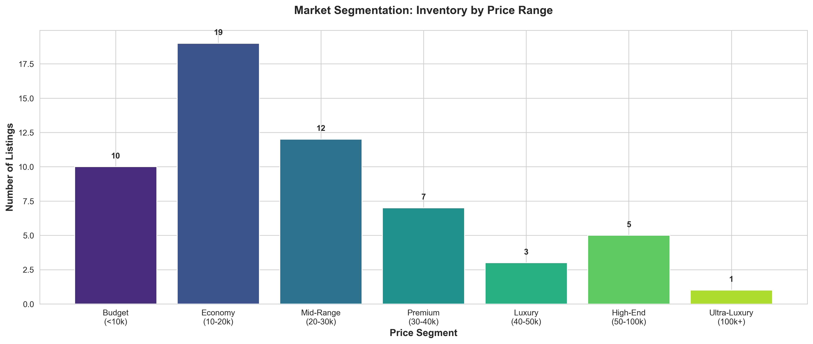

The market segments clearly into distinct price tiers: budget (<10k), economy (10-20k), mid-range (20-30k), premium (30-40k), luxury (40-50k), high-end (50-100k), and ultra-luxury (100k+). The economy and mid-range segments contain the highest inventory volumes.

**Why This Matters:**
- **Target audience definition:** Different price segments attract distinct buyer demographics
- **Marketing personalization:** Messaging should vary by price segment
- **Commission optimization:** Understanding segment distribution enables strategic pricing

**Recommended Actions:**
- Develop segment-specific marketing campaigns
- Create filtered search experiences by price range
- Tailor seller incentives by segment to balance inventory
- Analyze conversion rates by segment to optimize resource allocation
- Build buyer personas for each price tier

---

### 15. New vs. Used Market Balance

**What the Data Shows:**
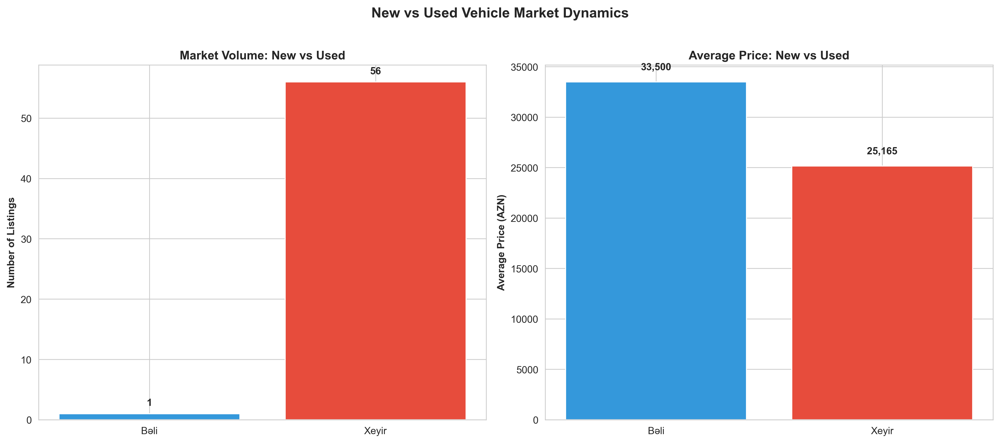

Used vehicles dominate the marketplace by volume, while new vehicles command premium prices. This distribution is typical for automotive marketplaces but reveals specific opportunities.

**Why This Matters:**
- **Market maturity:** Heavy used vehicle focus indicates established secondary market
- **New vehicle opportunity:** Limited new inventory suggests potential partnership opportunities with dealers
- **Buyer journey:** Different marketing approaches needed for new vs. used buyers

**Recommended Actions:**
- Develop dealer partnerships to increase new vehicle inventory
- Create separate user experiences for new vs. used vehicle shoppers
- Implement certified pre-owned programs to bridge new/used segments
- Track buyer migration between new and used inventory
- Develop new vehicle launch marketing campaigns

---

## Critical Business Recommendations

### Immediate Priorities (0-30 Days)

1. **Optimize Premium Listings:** Implement enhanced visibility packages for vehicles priced above 40,000 AZN to maximize high-value transactions

2. **Geographic Expansion:** Launch targeted seller acquisition campaigns in Ganja, Sumqayit, and other secondary markets with <5 current listings

3. **Engagement Analysis:** Conduct deep-dive analysis of top 10% highest-engagement listings to identify replicable success factors

4. **Pricing Tools:** Deploy automated pricing recommendations based on year, mileage, and comparable vehicles

### Medium-Term Initiatives (1-3 Months)

1. **Financing Integration:** Partner with 2-3 financial institutions to offer integrated buyer financing with instant pre-approval

2. **Electric Vehicle Focus:** Create dedicated EV marketplace section with specialized filters, charging station maps, and cost calculators

3. **Seller Education:** Launch seller success program with data-driven pricing guidance, photography best practices, and engagement optimization

4. **Mobile Inspection Services:** Deploy regional inspection services to support sellers outside Baku and increase trust

### Strategic Investments (3-6 Months)

1. **AI-Powered Matching:** Develop buyer-seller matching algorithms considering barter preferences, trade-in scenarios, and financing needs

2. **Certified Pre-Owned Program:** Launch platform-backed certification to command premium pricing and reduce buyer risk

3. **Dealer Network:** Build formal dealer partnerships to increase new and certified inventory

4. **Analytics Dashboard:** Provide sellers with real-time performance metrics, competitive pricing data, and market trend insights

---

## Risk Mitigation

### Geographic Concentration Risk
**Risk:** Over-reliance on Baku market creates vulnerability to local economic conditions
**Mitigation:** Accelerate regional expansion with dedicated regional managers and localized marketing

### Premium Inventory Scarcity
**Risk:** Limited luxury inventory constrains high-value transaction growth
**Mitigation:** Develop white-glove service for premium sellers including professional photography and concierge support

### Data Completeness
**Risk:** Many listings have incomplete information, reducing buyer confidence
**Mitigation:** Implement mandatory field requirements and seller incentives for complete listings

---

## Performance Metrics to Monitor

### Leading Indicators
- Listing engagement rates (views per listing)
- Time-to-sale by price segment and body type
- Seller repeat rate and platform loyalty
- Geographic distribution of new listings

### Revenue Drivers
- Average transaction value by segment
- Premium listing adoption rate
- Financing attachment rate
- Trade-in facilitation rate

### Market Health
- New vs. used inventory ratio
- Average vehicle age in inventory
- Price competitiveness vs. market benchmarks
- Regional market penetration rates

---

## Conclusion

Avtovitrin.com operates in a dynamic automotive marketplace with clear opportunities for growth and optimization. The platform successfully serves multiple market segments from budget to ultra-luxury, with strong presence in Baku and emerging regional footprints.

**Key Success Factors Moving Forward:**

1. **Diversify geographically** to reduce concentration risk and capture underserved markets
2. **Optimize for premium transactions** through enhanced services and targeted acquisition
3. **Leverage data intelligence** to provide sellers with competitive advantages
4. **Build ecosystem partnerships** around financing, inspection, and certification
5. **Enhance buyer confidence** through transparency, data completeness, and quality assurance

By executing on these insights, Avtovitrin.com can strengthen its market position, increase transaction values, and build sustainable competitive advantages in the automotive marketplace sector.

---

*Analysis based on 57 active listings as of December 28, 2024*
*All visualizations and data points available in the `/charts` directory*
